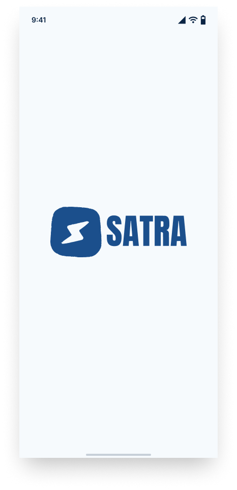
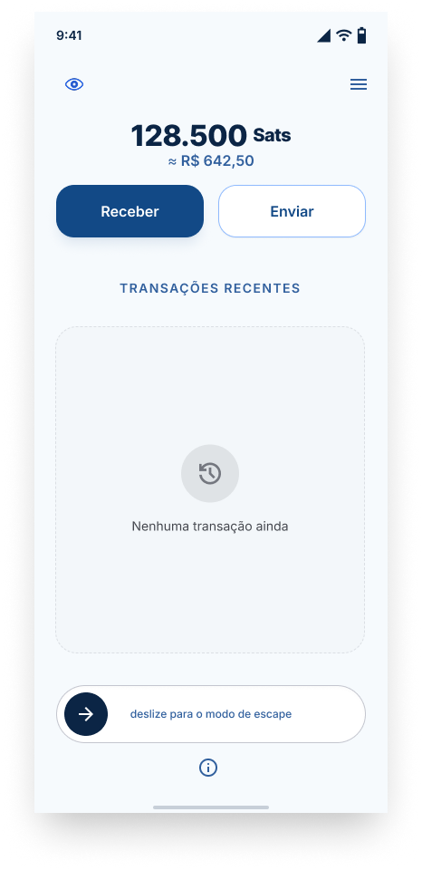
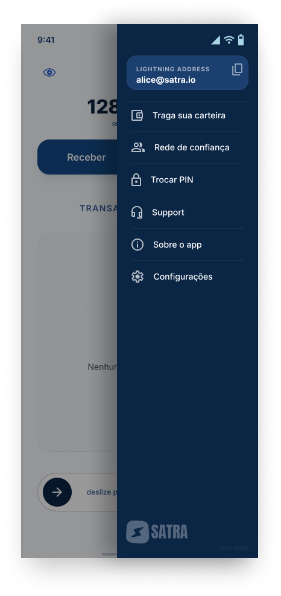
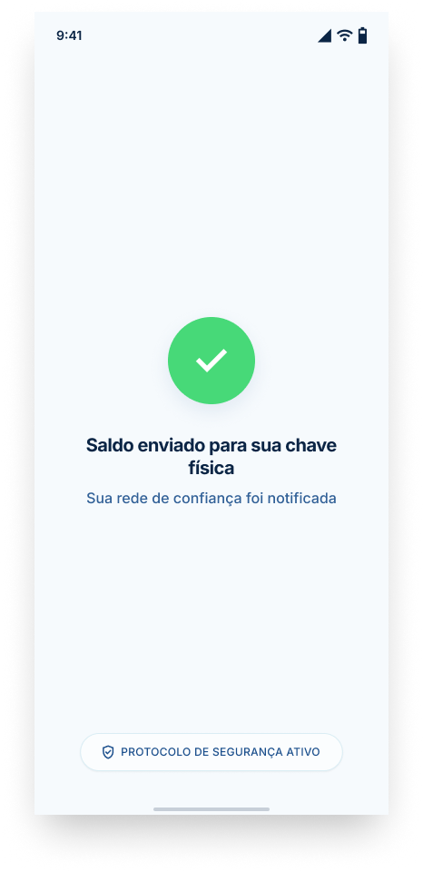

# SATRA WALLET
Satra é um aplicativo de celular disfarçado de calculadora nativa do sistema. Por fora, funciona como uma calculadora de verdade. Por dentro, é uma carteira Lightning (bitcoin) completa, criada pra mulheres em situação de violência doméstica guardarem uma reserva financeira sem deixar rastro visível pra quem monitora o celular delas.

# O Problema
Controle financeiro é uma forma comum e pouco discutida de abuso doméstico. Agressores costumam monitorar extratos bancários, cartões, Pix e apps financeiros no celular da vítima, o que impede que ela consiga guardar dinheiro pra conseguir sair da relação. O desafio não é "segurança contra hackers" — é invisibilidade social: o adversário tem acesso físico direto ao celular.

# Público
Mulheres em situação de violência doméstica, ainda convivendo com o agressor;
Mulheres em processo de planejamento de saída de uma relação abusiva;
Rede de apoio ao redor delas: família, amigas, ONGs, assistentes sociais.

# Fluxo de uso completo
1. Onboarding (primeiro acesso)

App instalado, estado "virgem" (sem PIN configurado)
Sequência-mestra fixa (ex: 0000=) digitada nesse estado abre, uma única vez, um modo de configuração
Nesse modo, a usuária define seu PIN pessoal (ex: 32+21=, disfarçado de conta matemática)
Depois de definido, a sequência-mestra deixa de funcionar como gatilho — não pode mais reabrir a configuração
Também nesse momento (ou depois, via configurações): cadastro de contatos de confiança (npub Nostr) e vinculação da chave física NFC

2. Uso do dia a dia

App abre sempre como calculadora funcional de verdade
Digitar o PIN pessoal + = troca a tela pra UI real da carteira
Tela da carteira mostra saldo em sats, opção de receber (Lightning Address / QR) e enviar
PIN é o método de acesso no celular já configurado — não depende do objeto físico

3. Botão de escape (modo de emergência)

Dentro da carteira, um botão de escape discreto (não chamativo). Ao ser acionado (com confirmação por gesto, tipo segurar, pra evitar acionamento acidental), dispara duas ações simultâneas:

Financeira: envia todo o saldo pra fora do celular (não fica retido em nenhum chip)
Alerta silencioso: envia uma DM criptografada via Nostr (NIP-17) pra rede de confiança previamente cadastrada, avisando que o escape foi ativado — sem precisar abrir nenhum outro app

Depois de executado, o app volta sozinho pra aparência de calculadora normal.

4. Chave física (NFC)

Chip NFC/NTAG regravável, escondido num objeto do cotidiano (chaveiro, colar, etc.)
Guarda a chave de acesso à carteira — não o saldo (modelo "cartão de banco": o dinheiro não está no cartão, o cartão só autoriza acesso à conta)
Papel específico: entra em cena só no fluxo de escape/restauração — se ela precisar recomeçar em outro celular, aproximar o chip restaura o acesso à carteira
Não é usado no desbloqueio do dia a dia (isso é papel do PIN)

# Arquitetura Técnica

1. Stack

Cross-platform: React Native
Lightning: implementado diretamente no app via Breez SDK — sem depender de Nostr Wallet Connect (NWC) nem de infraestrutura própria rodando. O app É a carteira, ponta a ponta;
Lightning Address: usado pra receber pagamentos de forma simples (formato tipo algo@dominio.com), facilitando o onramp via contato de confiança;
Identidade Nostr: cada instalação gera automaticamente um par de chaves novo (nsec descartável), sem vínculo com telefone/e-mail/identidade real, guardado em armazenamento seguro do sistema (Android Keystore / iOS Keychain);
Nostr — canal de socorro: alerta de escape enviado via DM criptografada usando NIP-17 (protege inclusive metadados, ao contrário do NIP-04);
NFC: chip NTAG regravável, compatível com padrão tipo Boltcard, guarda credencial/chave de acesso (não o saldo);

# Identidade Visual

1. Nome

Satra (Satra Wallet) — nome curto, sonoro, com raiz derivada de "sats" (unidade do bitcoin)

2. Paleta de cores

Azul marinho (#0B2545) Texto de destaque, elementos principais
Azul médio (#1B4F8C) Botões/ações primárias
Azul claro (#A9D6E5A) centos, elementos secundários
Fundo (#F4F8FB) Fundo claro, leve tom azulado (não branco puro)

Critério geral: transmitir confiança e transparência (associação com azul), sem chamar atenção — nada saturado ou vibrante demais, já que o app precisa passar despercebido.

3. Logo

## Telas do app

### Onboarding

| Splash | Configuração do PIN |
|---|---|
|  |  |

Ver progressão do design (5 estados)

### Carteira

| Wallet Home | Menu |
|---|---|
|  |  |

| Receber | Confirmação de escape |
|---|---|
|  |  |

Ver detalhes da wallet (saldo oculto, popup de escape, swipe completo)

### Recuperação

